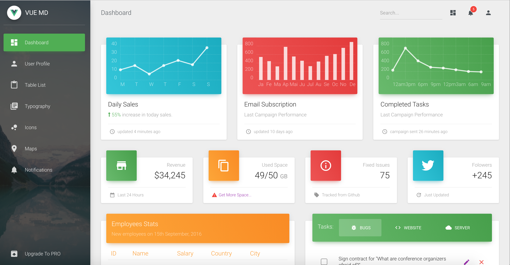
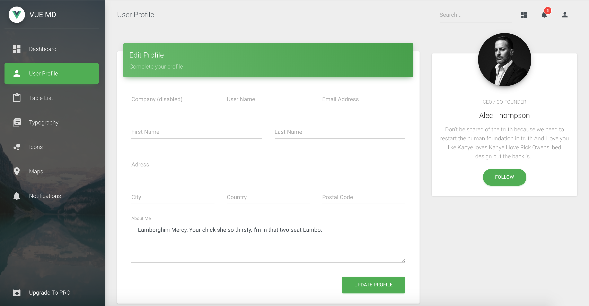
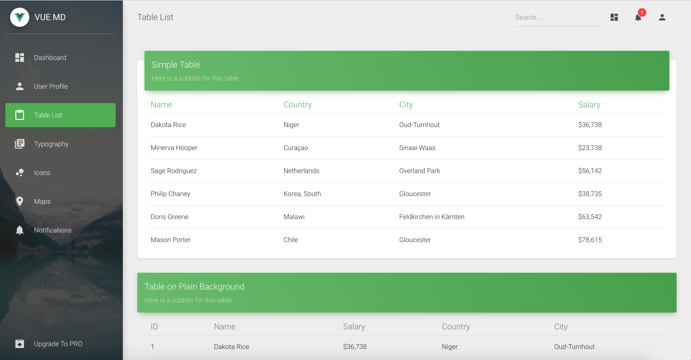
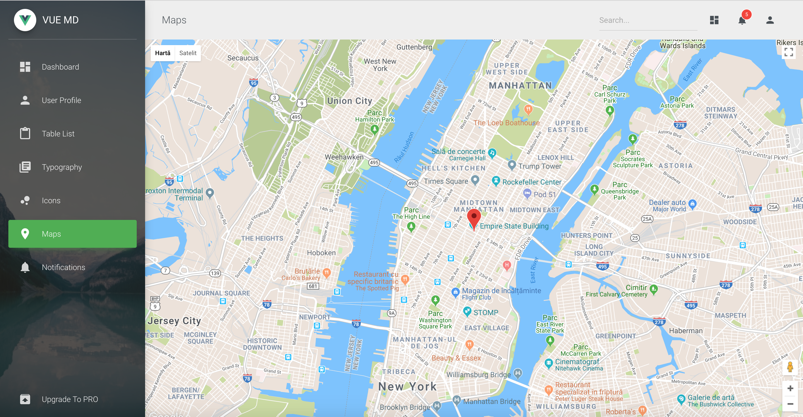
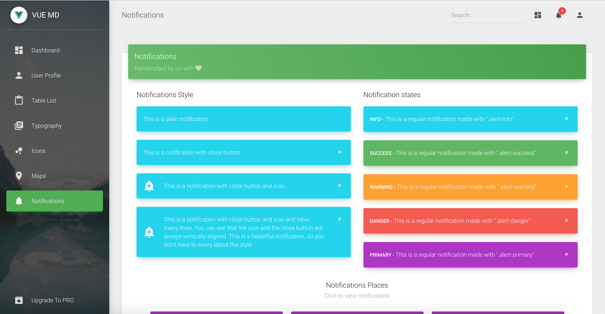

# [Vue Material Dashboard](https://demos.creative-tim.com/vue-material-dashboard) 

       

## Demo

| Dashboard | User Profile | Tables | Maps | Notification |
| --- | --- | --- | --- | --- |
|  |  |  |  | 

## Quick start

## :cloud: Build Setup

### install dependencies
`npm install`
### serve with hot reload at localhost:8080
`npm run dev`
### build for production with minification
`npm run build`
